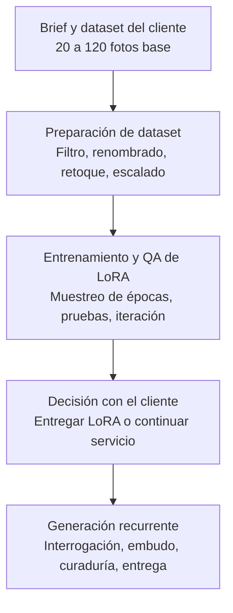
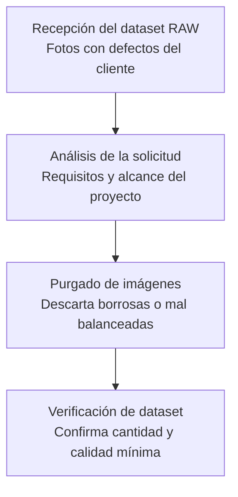
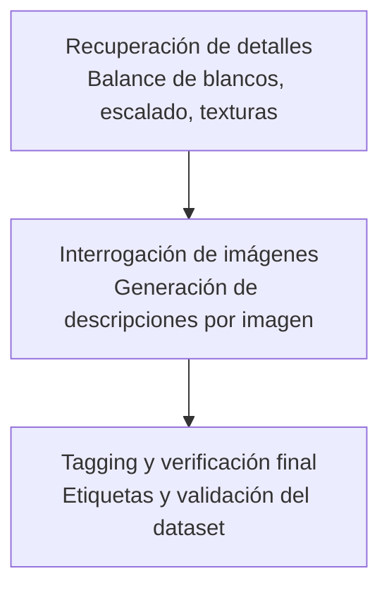
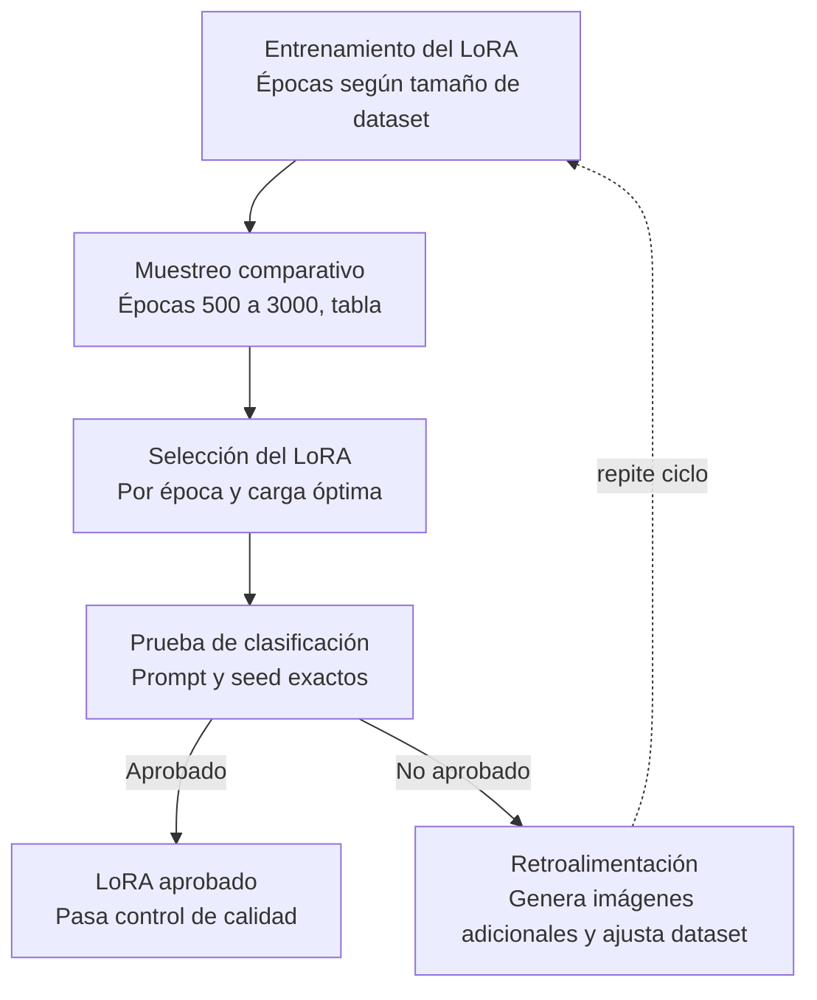
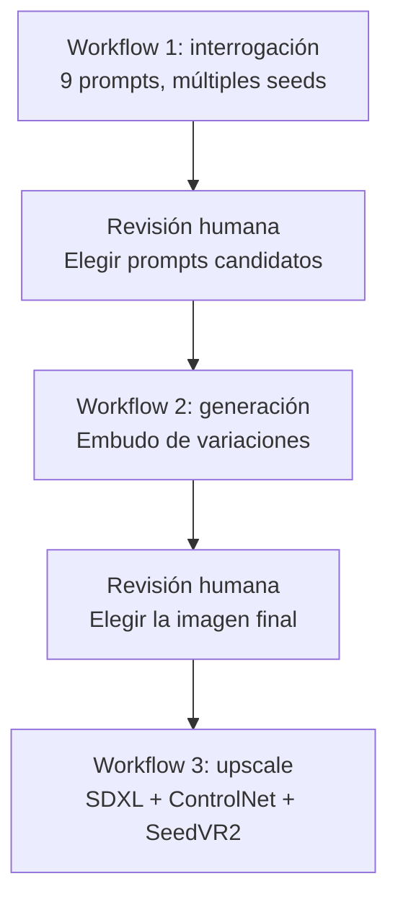

# Pipeline de identidad hiperrealista con IA generativa

> Proceso de producción para generar contenido visual consistente y hiperrealista de una identidad específica, usando entrenamiento de LoRA, interrogación estructurada y generación por lotes.

**Nota sobre este repositorio:** las generaciones que ilustran este caso usan una identidad propia entrenada para fines de demostración, no un cliente real. El proceso descrito sí se ha aplicado en trabajo comercial con clientes reales; esos casos se omiten aquí por confidencialidad.

## Resumen del servicio

Un cliente aporta un dataset de 20 a 120 fotos de una persona y solicita un volumen mensual de contenido (30–60 imágenes) hiperrealista, consistente y sin deformaciones, en escenarios propios o consistentes con el dataset. El proceso completo cubre desde la preparación del dataset hasta la entrega recurrente de contenido.

## Visión general del pipeline

### 1. Brief y dataset del cliente
- Dataset de 20–120 fotos de referencia.
- Requisitos: hiperrealismo, consistencia de identidad, piel realista, escenarios del dataset o consistentes con él.
- Volumen mensual acordado: 30–60 imágenes.

### 2. Preparación de dataset

<strong>Ver detalle completo (7 pasos, opcional)</strong>

1. **Recepción del dataset RAW** — el cliente entrega entre 20 y 120 fotos, con defectos típicos (desenfoque, balance de blancos incorrecto, etc.).
2. **Análisis de la solicitud** — se define el alcance: qué necesita el cliente, en qué escenarios, con qué nivel de fidelidad.
3. **Purgado de imágenes** — se descartan fotos borrosas, con expresiones exageradas o inutilizables.
4. **Verificación de dataset** — se confirma que la cantidad y calidad restante es suficiente para entrenar.
5. **Recuperación de detalles** — mejora de balance de blancos y calidad (Qwen Edit, o Lightroom de forma manual y opcional), reescalado y reconstrucción de texturas con un upscaler.
6. **Interrogación de imágenes** — se genera una descripción estructurada de cada imagen del dataset.
7. **Tagging y verificación final** — se etiquetan las imágenes con la convención `{trigger_word}_{0000}.jpg` y se valida el dataset completo antes de entrenar.

### 3. Entrenamiento y control de calidad del LoRA
Ver detalle en la siguiente sección.

### 4. Decisión con el cliente
Al aprobar el LoRA, el cliente elige entre:
- Recibir el LoRA entrenado, o
- Continuar con el servicio de generación recurrente.

### 5. Generación recurrente
- El cliente comparte semanalmente una imagen de referencia con el estilo deseado.
- Esa imagen pasa al proceso de interrogación y generación en embudo (ver sección de workflows).

## Detalle: ciclo de entrenamiento y QA

<strong>Ver diagrama, tabla de muestreo y criterio de aprobación (opcional)</strong>

### Tabla de muestreo comparativo (plantilla)

| Época | Prompt random | Prompt específico | Prompt específico, multi-seed | Multi-formato (wide / ultrawide / portrait) | Veredicto |
|---|---|---|---|---|---|
| 500  | | | | | |
| 1500 | | | | | |
| 2000 | | | | | |
| 3000 | | | | | |

*(Pendiente: llenar con resultados reales del caso de demostración)*

### Criterio de aprobación
Un LoRA se considera aprobado cuando, dado un prompt y una seed específicos, reproduce el resultado esperado de forma consistente. Si falla, se generan imágenes adicionales para las escenas o poses que fallaron, se retroalimenta el dataset con ellas, y se repite el ciclo completo de entrenamiento y QA hasta aprobar.

## Generación recurrente: interrogación y embudo

<strong>Ver diagrama del embudo de generación (opcional)</strong>

## Herramientas usadas
- **Entrenamiento:** musubi-tuner, ComfyUI
- **Interrogación:** Qwen3-VL (8B / 4B Instruct)
- **Generación:** Krea 2 (Raw para entrenamiento, Turbo para inferencia)
- **Upscale:** SDXL Lustify Endgame, ControlNet Tile Xinsir, SeedVR2, JoyTag

## Workflows de ComfyUI

*(Pendiente: agregar los archivos `.json` en `/workflows`, con nodos Note documentando el criterio de cada punto de revisión)*

- `workflows/01_interrogacion.json`
- `workflows/02_generacion.json`
- `workflows/03_upscale.json`

## Caso de demostración

*(Pendiente: agregar capturas del caso — dataset de ejemplo, tabla de épocas real, contact sheets de interrogación y generación, resultado final)*
